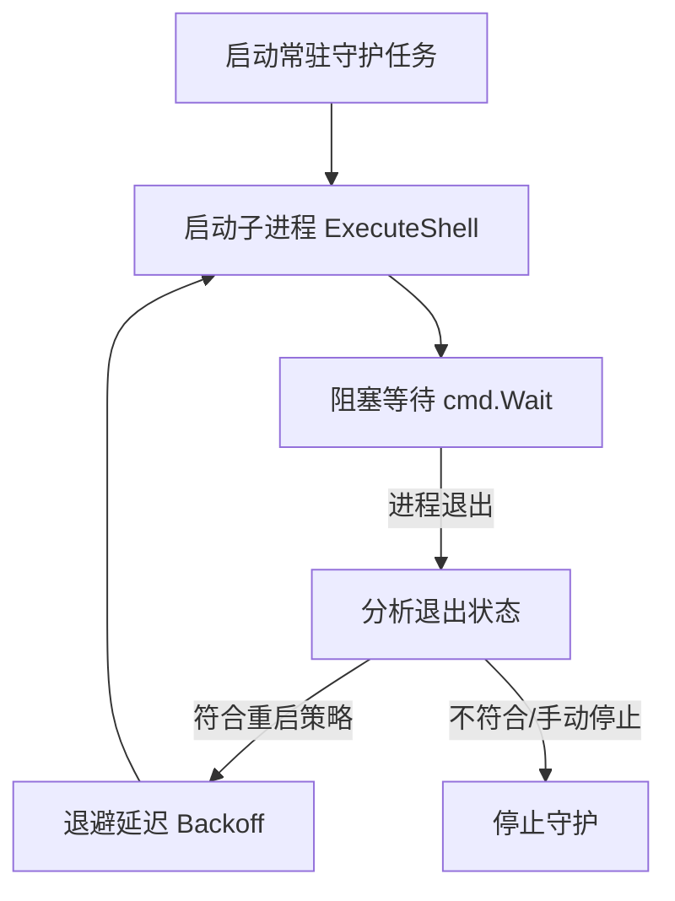

# 架构决策记录 (ADR) - 类 Supervisor 常驻进程守护功能设计

- **设计日期**：2026-06-05
- **评估模块**：`internal/scheduler`, `internal/model`, `web/`
- **任务编号**：Task-05
- **当前状态**：[SCAN] 架构探讨与对齐

---

## 1. 背景与核心价值

Cronix 目前是一个基于时间的任务调度器（短生命周期任务，运行完即退出）。然而，在真实的生产环境中，用户往往需要同时管理两类任务：
1. **定时任务**（如每天凌晨 2 点备份数据库） —— 目前已完美支持。
2. **常驻守护进程**（如消息队列消费者、Web API 服务、数据流实时监听脚本） —— 这类任务一旦挂掉，必须立刻被拉起，类似于 Supervisor 的功能。

如果能在 Cronix 中集成类 Supervisor 的常驻进程守护功能，系统将演变为一个“定时调度 + 进程守护”的双引擎工业控制台，极大拓宽其适用场景。

---

## 2. 核心架构设计

### 2.1 任务运行模式扩展 (Run Mode)
在任务数据模型 `model.Task` 中，新增一个运行模式字段 `RunMode`：
- **`cron` (默认模式)**：基于 `CronExpr` 定时触发，属于短生命周期任务。
- **`daemon` (常驻守护模式)**：忽略 `CronExpr`，启动后长驻后台，由调度器持续监控其运行状态，异常退出时自动拉起。

### 2.2 类 Supervisor 守护进程引擎设计 (Daemon Monitor Engine)
我们可以在 `internal/scheduler` 下新增 `DaemonMonitor` 守护控制器：



- **重启策略 (Restart Policy)**：
  - `always`：无论子进程因何种原因退出，均自动重启。
  - `on-failure`：仅当子进程以非 0 退出码异常退出，或者因系统信号崩溃时，才自动重启。
  - `never`：退出后保持停止状态。
- **延迟退避算法 (Restart Backoff)**：
  - 首次重启延迟 1 秒，连续失败时翻倍（1s -> 2s -> 4s -> 8s），最大延迟 60 秒。
- **状态转移图 (Process States)**：
  - `STOPPED`：常驻任务未启动。
  - `STARTING`：正在拉起进程。
  - `RUNNING`：子进程处于活跃状态，正常运行。
  - `BACKOFF`：进程异常退出，正在等待重试退避期。
  - `FATAL`：连续重启失败次数超过阈值，放弃重启并报警。

---

## 3. UI 操作界面设计 (User Interface & UX)

在前端 Web 界面中，常驻守护进程面板将与原有定时任务进行融合与区分。

### 3.1 任务卡片/列表线框图 (Dashboard Wireframe)

```text
+--------------------------------------------------------------------------------------------------+
|  Cronix Task Console                                                               [ 新增任务 + ]|
+--------------------------------------------------------------------------------------------------+
| [定时任务 (4)]  [*常驻守护 (2)*]  [全部任务 (6)]                                                 |
+--------------------------------------------------------------------------------------------------+
| 名称 / 运行模式     PID / 状态         Nice / I/O    运行时长     最近日志摘要         操作            |
|--------------------------------------------------------------------------------------------------|
| sms_queue_worker   [ 94812 ]          nice: 10      2d 14h 5s    "Waiting for message [Start]    |
| [ Daemon 模式 ]    ( RUNNING • 绿闪)  io: Class 2                ..."                 [■ Stop]    |
|                                                                                       [查看日志]  |
|--------------------------------------------------------------------------------------------------|
| cache_preheater    [   --  ]          nice: 19      --           "Exited with code 1  [▶ Start]   |
| [ Daemon 模式 ]    ( FATAL  • 红 )    io: Class 3                Backoff limit..."    [ Stop ]    |
|                                                                                       [查看日志]  |
+--------------------------------------------------------------------------------------------------+
```

### 3.2 任务编辑弹窗配置项设计 (Config Modal Details)

在创建/修改任务弹窗中，当选择 `运行模式 = 常驻守护 (Daemon)` 时，动态展示以下配置：

- **重启策略** (下拉选择框)：
  - `[x] 总是自动重启 (Always)` (默认)
  - `[ ] 仅在崩溃/异常退出时重启 (On Failure)`
  - `[ ] 永不自动重启 (Never)`
- **重启退避阀值** (数字滑块输入)：
  - 范围：`1秒 - 60秒` (连续拉起失败时的起始等待延迟)
- **Linux 物理硬限额**：
  - **最大内存限额 (Memory Limit)**：输入框 (如 `512MB`)
  - **CPU 使用配额 (CPU Quota)**：输入框 (如 `50%`)
  - **Nice 调度优先级**：数值滑块 (从 `-20` 高优先级 至 `19` 低优先级)
  - **I/O 调度级别 (IONice Class)**：下拉框 (`Class 1 Realtime`, `Class 2 Best-Effort`, `Class 3 Idle`)

---

## 4. UI 界面视觉概念原型稿 (Visual Mockup)

下面是利用 Antigravity 设计系统生成的**类 Supervisor 常驻进程调度管理看板（Sleek Dark Mode）**的高清视觉草图：


