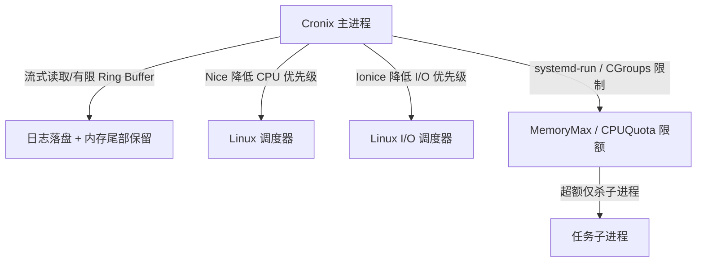

# 架构评估记录 (ADR) - Linux 环境下大脚本执行稳定性与资源硬隔离方案

- **评估日期**：2026-06-05
- **评估模块**：`internal/executor`, `internal/scheduler`
- **任务编号**：Task-04

---

## 1. Linux 环境下大脚本执行的核心稳定性威胁

在 Linux 生产环境中，若定时任务脚本遭遇大计算量（高 CPU）、内存泄漏（高 Memory）或超长执行时间（高 I/O 读写），将直接对系统产生以下冲击：

1. **大日志内存泄露 (High Risk)**：当前 Unix 执行器使用 `bytes.Buffer` 阻塞式读取全部输出并转为内存字符串。超大日志会瞬间撑爆 Go 堆内存，触发 OOM 被 Linux 内核强制杀掉主进程。
2. **CPU 饱和与调度饥饿**：Go runtime 的定时调度和 Web 服务依赖操作系统的 CPU 分配。高计算脚本若把所有核心占满，会导致 Cronix 的协程（Goroutine）无法被即时调度，引发任务漏触发。
3. **I/O 阻塞引发系统假死**：大脚本频繁读写磁盘会导致严重的 I/O Wait。这会阻塞 Cronix 对数据库的读写，并导致控制台 API 响应时间超过 `150ms` 并发查询硬性指标。
4. **子进程逃逸与僵尸进程**：当主进程因为超时使用 `SIGKILL` 终止进程组时，若子进程自身调用了 `setsid()` 或处于 D 状态（不可中断睡眠），可能导致进程清理不彻底或残留僵尸进程。
5. **数据库体积爆满与读写性能恶化**：若大脚本执行高频且带有大量控制台输出，哪怕有 64KB 的截断，也会在短时间内写入海量数据。由于当前清理机制为“每小时定时被动清理”，如果脚本在数分钟内发生突发性故障并疯狂报错，会直接把 SQLite 磁盘撑爆，导致事务阻塞、索引失效，进而导致系统整体瘫痪。
6. **磁盘空间无限制蚕食 (New)**：如果我们将详细的任务日志移出数据库转存至磁盘以支持大日志保存，若缺乏合理的滚动和清除机制，长期运行的大任务会产生数十至数百 GB 的冷日志，最终将物理磁盘空间彻底蚕食，导致整个 Linux 系统崩溃。

---

## 2. 针对 Linux 环境的架构防线与优化建议

为了消除以上威胁，必须在 Linux 环境下建立多重架构防线，从**内存、CPU、I/O、日志**四个维度实施硬隔离与优化：



### 2.1 内存防御：流式日志（Streaming Log）与 Ring Buffer
- **现状技术债**：使用 `cmd.Stdout = &stdout` 一次性读入内存。
- **优化建议**：
  1. **禁止内存堆积**：物理移除 `bytes.Buffer`。通过 `cmd.StdoutPipe()` 和 `cmd.StderrPipe()` 获取流式 Reader。
  2. **异步落盘**：启动轻量协程（Goroutine）将流式数据实时追加写入磁盘文件（例如 `data/logs/task_<id>_exec_<id>.log`）。
  3. **内存环形缓冲区**：在内存中仅使用一个固定大小（例如 `1MB`）的环形缓冲区（Ring Buffer）滚动记录最新的尾部输出（Tail Log），仅供控制台展示，确保无论日志多大，主进程内存开销恒定。

### 2.2 资源硬隔离：利用 Linux CGroups (Control Groups)
- **现状技术债**：子进程与主进程共享同一命名空间和资源组，缺乏资源约束。
- **优化建议**：
  1. **采用 systemd-run 动态 Scope 隔离**：
     在启动子进程时，通过 `systemd-run` 命令动态包装任务进程。例如：
     ```bash
     systemd-run --scope -p MemoryMax=512M -p CPUQuota=50% --slice=cronix-tasks.slice sudo -u <runAs> sh -c "<command>"
     ```
     - `MemoryMax=512M`：硬性限制该任务的最大物理内存。一旦脚本内存泄露超过 512MB，Linux 内核的 OOM-killer 会**精准杀死该脚本子进程，而绝对不会波及 Cronix 主进程**。
     - `CPUQuota=50%`：硬性限制该脚本最多只能榨取单核 50% 的 CPU，防止其占满全部核心。
  2. **cgroup.procs 手动写入（轻量备选）**：
     若系统没有 systemd，可在主进程启动子进程后，获取其 PID，手动写入事先建好的 `/sys/fs/cgroup/memory/cronix/cgroup.procs` 中。

### 2.3 调度避让：降低 CPU 与 I/O 调度优先级 (Nice & Ionice)
- **现状技术债**：子进程与主进程拥有相同的调度权重。
- **优化建议**：
  在 Linux 层面，将子进程的 CPU 和 I/O 优先级降至最低，实行“低优先级避让”策略：
  ```bash
  nice -n 19 ionice -c 3 sudo -u <runAs> sh -c "<command>"
  ```
  - **Nice 19**：将 CPU 优先级降至最低（Nice值范围 -20 到 19）。当 CPU 繁忙时，系统会优先确保 Cronix 主进程和 Web 服务运行，只有在 CPU 空闲时才分配给该大脚本。
  - **Ionice -c 3 (Idle)**：将 I/O 磁盘读写调度类别设置为 Idle。脚本只有在系统没有其他 I/O 活动时才能读写磁盘，避免因大脚本的高频磁盘读写导致 Cronix 进程卡在 I/O 等待中。

### 2.4 超时兜底与僵尸进程回收
- **现状实现**：`syscall.Kill(-pid, syscall.SIGKILL)` 已实现进程组清理，是良好的基础。
- **进一步保障**：
  - 在执行 `Wait()` 结束后，使用 `os.FindProcess` 结合 `signal 0` 定期探测进程组状态。
  - 若超时后子进程处于僵尸状态（Z 状态）或因不可中断睡眠（D 状态）无法退出，应向主系统发送“执行器资源阻塞”的告警，提醒 systemd 进程回收或系统管理员进行物理干预。

---

## 3. 数据库日志硬限额方案设计

为防止劣币驱逐良币以及突发故障产生海量日志压垮数据库，必须引入“全局+单任务”双重数据库日志限额机制：

1. **引入单任务日志配额（Task-Level Quota）**：
   - 每次 `executeTask` 写入日志后，**同步或异步**在数据库中仅清理当前 `task_id` 的超额日志（保留最新的 $N$ 条，默认如 1,000 条）。
   - **好处**：故障高频脚本只能在属于自己的 1,000 条配额内进行自我覆盖，完全不会稀释或强删其他重要定时任务的历史日志。
2. **从“小时被动清理”向“实时/计数器主动清理”演进**：
   - 主进程内存中维护一个共享计数器。每向数据库写入 500 条日志时，便异步触发一次全局日志清理。将清理时效从“1小时”压缩到“分钟级”，防范突发故障把数据库挤爆。
3. **数据库物理文件大小阈值熔断 (Max DB File Size Protection)**：
   - 每次写入日志前，检测数据库文件大小。若物理文件突破阀值（如 5GB），立刻将日志记录降级为熔断模式：**停止往数据库写入该次任务的标准输出，只保留轻量状态信息**。
4. **高频任务的自动输出截断下调 (Frequency-Based Truncation)**：
   - 针对执行周期短（如小于 10秒）的任务，其最大日志输出截断大小从全局的 `64KB` 自动强制下调至 `2KB` 甚至 `1KB`，从源头上减少大量小行堆积的物理写压力。

---

## 4. 磁盘任务日志滚动与保留硬限额设计 (New)

对于磁盘冷/温日志文件，虽有更大承载级别，但仍必须设定硬限额，包括以下四个维度的设计：

### 4.1 大小分割与自动滚动 (Size-Based Rotation)
- **机制**：对每个任务在磁盘上的追加日志文件（例如 `data/logs/task_<id>.log`），引入文件大小限制。
- **具体做法**：
  - 设定单任务日志最大大小 `MaxFileSizeMB`（默认 50MB）。
  - 当日志文件超过 50MB 时，系统自动触发滚动：将当前日志重命名为备份文件并使用 `gzip` 压缩为 `task_<id>.log.1.gz`，接着创建新的 `task_<id>.log` 接受流式写入。
  - **对冲开销**：通过 `gzip` 压缩冷日志，可以将文本体积压缩 80%~90%，极大缓解磁盘压力。

### 4.2 备份上限管理 (Max Backup Protection)
- **机制**：限制单个任务的最大备份个数。
- **具体做法**：
  - 设定 `MaxBackups` 参数（默认 5 个备份）。
  - 每次发生日志滚动且产生新的 `.gz` 备份时，自动清扫该任务的旧备份。如果发现已存在 `task_<id>.log.6.gz`，则物理删除该最旧的备份。
  - **空间锁死**：这意味着单个任务的最大磁盘占用被限制在：`50MB + 5 * 50MB * 压缩率 ≈ 75MB`。磁盘空间在单任务级别实现了完美的可预测上限。

### 4.3 物理磁盘空闲比例熔断 (Disk Space Safety Valve)
- **机制**：在写入磁盘前，检测存储分区的空闲磁盘空间比例。
- **具体做法**：
  - 在 Linux 下，定期使用 `syscall.Statfs` 调用读取日志存储分区的 `Bfree` 和 `Blocks` 计算磁盘空闲率。
  - 一旦发现**剩余磁盘空间低于 10%**（或者绝对可用空间少于 10GB），立即拉响磁盘空间警报。
  - 此时系统强制调低日志滚动阀值，甚至直接**停止写入磁盘日志，改为直接丢弃**，优先确保 Linux 操作系统和主进程拥有足够的磁盘空间运行。

### 4.4 备份生命周期清理 (Max Age Expiry)
- **机制**：冷日志的历史时效控制。
- **具体做法**：
  - 设定 `MaxAgeDays`（默认 30 天）。
  - 启动定时清理器，每天定时扫描 `data/logs` 目录下所有的 `.gz` 备份文件，并解析其修改时间（mtime）。如果发现修改时间超过 30 天，则一律进行物理删除，防止非活动任务的旧日志长期残留。
